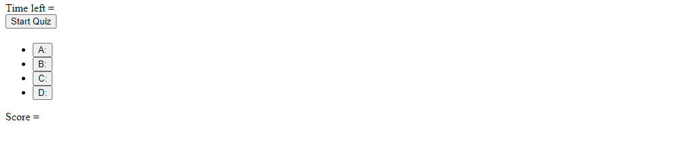
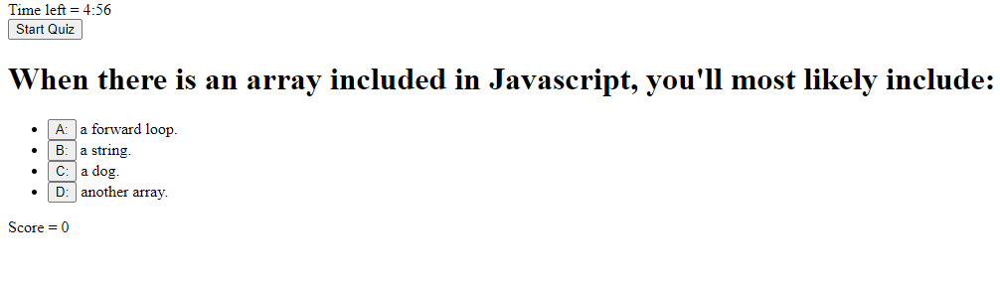

# timed-code-quiz

## Project Description
- I created a timed code quiz by implementing a timer and objects. I also implemented a score tracker that adds a point for every correct answer. 

## How it works:
- When the user clicks on the "Start Quiz" button, the timer will start counting down from 5 minutes. 
- The first question will appear once the "Start Quiz" button is clicked as well. 
- After answer a question, the webpage will display whether the user clicked on the correct answer or the wrong answer. 
- The next question will appear after an answer has been clicked on by the user. 
- The score will increase by 1 on the next question if the user clicked on the correct answer in the previous question. 
- If the user does not finish in the alotted time then the user will be alerted that they have ran out of time. 

## Project Screenshot 

